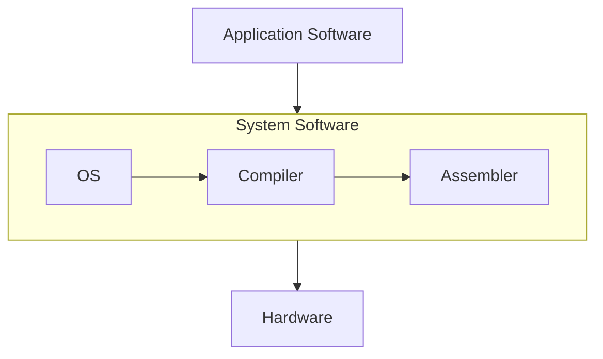

# RISC-V Based MYTH Workshop

## Workshop Contents

- [Day 1 - Introduction to RISC-V ISA and GNU Compiler Toolchain](#day-1---introduction-to-risc-v-isa-and-gnu-compiler-toolchain)
- [Day 2 - Introduction to ABI and Basic Verification Flow](#day-2---introduction-to-abi-and-basic-verification-flow)
- [Day 3 - Digital Logic with TL-Verilog and Makerchip](#day-3---digital-logic-with-tl-verilog-and-makerchip)
- [Day 4 - Basic RISC-V CPU Micro-architecture](#day-4---basic-risc-v-cpu-micro-architecture)
- [Day 5 - Complete Pipelined RISC-V CPU Micro-architecture](#day-5---complete-pipelined-risc-v-cpu-micro-architecture)

## Day 1 - Introduction to RISC-V ISA and GNU Compiler Toolchain

<details>
  <summary><b>RV Day 1</b></summary>
  
### D1SK1 - Introduction to RISC-V basic keywords  
**Instruction Set Architecture(ISA):**  
An Instruction Set Architecture (ISA) is the interface between a computer's hardware and software. It defines the set of instructions a processor can execute, including operations like arithmetic, data movement, and control flow. Example : x86, ARM , RISC-V

**The Bigger Picture:**

An application software that we use on PCs or mobiles are converted into binary language(machine code) by the system software which is then executed by the hardware.
System Software
-	**Operating System(OS)**
    -  Handle I/O operations, allocate memory, low level system functions
-	**Compiler**
    - Converts the application written in high level language(C, C++, Java) into assembly language of the respective ISA.
-	**Assembler**
    - The Assembly code from previous step is converted to binary language by the Assembler.
 
**Contents :** 
-	Pseudo Instructions :
  
  <p align="center">
    
  </p>

-	Base integer Instructions RV64I :

  <p align="center"> 
    
  </p>

-	Multiply extension RV64M :
  
  <p align="center"> 
    
  </p>
  
-	Single and duouble precision floating point extension RV64F & RV64D :
  
  <p align="center"> 
    
  </p>
  
-	Application Binary Interface :
  
  <p align="center"> 
    
  </p>
  
-	Memory allocation and stack pointer :
  
  <p align="center"> 
    
  </p>

### D1SK2 - Labwork for RISC-V software toolchain    

```bash
# cd into the root directory
cd 

# open a file using an editor to write the C code to compute the sum of n natural numbers
gvim sum1ton.c

# Compile the code using the gcc compiler
gcc sum1ton.c

# Run the binary output file 
./a.out
```

  <p align="center"> 
    
  </p>
  <p align="center"> 
    
  </p>  
  
```bash

# Compile the code using the RISC-V gcc compiler
riscv64-unknown-elf-gcc -O1 -mabi=lp64 -march=rv64i -o sum1ton.o sum1ton.c

# check for the output file 
ls -ltr ./sum1ton.o

# To view the object and disassembler file
riscv64-unknown-elf-objdump -d sum1ton.o >> sum1ton.dis
gvim sum1ton.dis
```

  <p align="center">
    
  </p>
  <p align="center">
    
  </p>  

```math
Number\ of\ instructions = \frac{(End\ address\ +\ 4\ -\ Start\ address)}{4}  
```
```math
Start\ address\ of\ main\ function\ =\ 10184  
```
```math
End\ address\ of\ main\ function\ = 101bc  
```
```math
Number\ of\ instructions = \frac{(101bc\ +\ 4\ -\ 10184)}{4}  = 0xF = 15
```

```bash

# Compile the code using the RISC-V gcc compiler
riscv64-unknown-elf-gcc -Ofast -mabi=lp64 -march=rv64i -o sum1ton.o sum1ton.c

# To view the object and disassembler file
riscv64-unknown-elf-objdump -d sum1ton.o >> sum1ton.dis
gvim sum1ton.dis
```

  <p align="center">
    
  </p>

```math
Start\ address\ of\ main\ function\ =\ 100b0  
```
```math
End\ address\ of\ main\ function\ = 100dc  
```
```math
Number\ of\ instructions = \frac{(100dc\ +\ 4\ -\ 100b0)}{4}  = 0xC = 12
```


```bash

# Compile the code using the RISC-V gcc compiler
riscv64-unknown-elf-gcc -Ofast -mabi=lp64 -march=rv64i -o sum1ton.o sum1ton.c

# To execute the output of previous step
spike pk sum1ton.o
```

  <p align="center">
    
  </p>

```bash

# To run in debug mode
spike -d pk sum1ton.o

# To run until a fixed address
until pc 0 100b0

# Pressing Enter key executes the next instruction

# To view the value in a register
reg 0 a2
```

<p align="center">
  
</p>

### D1SK3 - Integer Number Representation    

Computers store and process data in the form of voltages. There are 2 digits in this system, when the voltage level is above a threshold it is represented by 1, when it is below a threshold it is considered 0. Each symbol in this system is called a bit (binary digit).  
8 bits  - 1 byte  
32 bits - 1 Word  
64 bits - 1 Double Word  

<p align="center">
  
</p>

The number of symbols that can be represented using n-bits is `2ⁿ`. So the range for unsigned integer is `0` to `2ⁿ-1`. For a signed integer the range is `−2ⁿ⁻¹` to `2ⁿ⁻¹ − 1`.
  


<p align="center">
  
</p>
<p align="center">
  
</p>

The negative numbers are represented using 2's complement.

<p align="center">
  
</p>
<p align="center">
  
</p>
<p align="center">
  
</p>
Instructions that operate on these kind of numbers are called Base integer instructions RV64I.  

### Lab

<p align="center">
  
  
  
  
  
  
  
  The reason the actual value is not shown is because of the typecasting.
  
  
</p>

</details>
    
## Day 2 - Introduction to ABI and Basic Verification Flow

<details>
<summary><b>RV Day 2</b></summary>
  
### D2SK1 Application Binary Interface (ABI)  
<details>
<summary><b>Theory Images</b></summary>
  <p align="center">
    
    
    
  </p>  
</details>  

There are 32 Registers in RISC-V architecture and XLEN defines the size of the registers, it can be 32 for RV32 and 64 for RV64.
<p align="center">
  
</p>

The data can be loaded on to the registers in 2 ways.  
- It can be loaded directly.
- It can be loaded from a location in the memory.

  The memory is byte addressable and based on how the bytes are arranged in the memory, it is classified as Big Endian and Little Endian.

**Endianness** defines the order in which bytes of a multi-byte data value are stored in memory.

- **Big Endian**: Most Significant Byte (MSB) is stored at the lowest memory address.
- **Little Endian**: Least Significant Byte (LSB) is stored at the lowest memory address.

#### Example

Consider the 32-bit value: 0x12345678  


| Memory Address | Big Endian | Little Endian |
|---------------|------------|---------------|
| 0x00 | 12 | 78 |
| 0x01 | 34 | 56 |
| 0x02 | 56 | 34 |
| 0x03 | 78 | 12 |

Although the **byte order in memory differs**, both representations store the same value `0x12345678`.

> Most modern processors, including **RISC-V**, use **little-endian** byte ordering by default.

<details>
<summary><b>Endian Images</b></summary>
  <p align="center">
    
    
    
  </p>  
</details>  

For example, let us consider an array M with 3 doublewords and we want to load the data in 3rd doubleword to the register x8. The instruction ld loads the 64 bit data at the address obtained by adding offset (16) to the contents of the source register rs1 (x23, in this case x23 has 0) to the destination register rd (x8).  
  <p align="center">
    
  </p>

All the instructions in RISC-V are 32 bits (irrespective of RV64 or RV32).   
<p align="center">
  
  
  
  
  
</p>  


### D2SK2 Lab work using ABI function calls  
<p align="center">
  
  
  
  
  
</p>

### D2SK3 Basic verification flow using iverilog
<p align="center">
  
</p>

```bash
# clone the Workshop collateral directory
git clone https://github.com/kunalg123/riscv_workshop_collaterals.git

# cd into the directory
cd riscv_workshop_collaterals

# Check if the files are there using ls -ltr
ls -ltr

# cd into labs
cd labs

# change the permissions & run the script to simulate the c code
chmod 777 rv32im.sh
./rv32im.sh
```
<p align="center">
  
  
</p>

</details>


## Day 3 - Digital Logic with TL-Verilog and Makerchip

<details>
<summary><b>RV Day 3</b></summary>

### D3SK1 Combinational logic in TL-Verilog using Makerchip
### D3SK2 Sequential logic
### D3SK3 Pipelined logic
### D3SK4 Validity
### up

</details>


## Day 4 - Basic RISC-V CPU Micro-architecture

<details>
<summary><b>RV Day 4</b></summary>

### D4SK1 Introduction to Simple RISC-V Micro-architecture
### D4SK2 Fetch and decode
### D4SK3 RISC-V control logic

</details>


## Day 5 - Complete Pipelined RISC-V CPU Micro-architecture

<details>
<summary><b>RV Day 5</b></summary>

### D5SK1 Pipelining the CPU
### D5SK2 Solutions to Pipeline Hazards
### D5SK3 Load/Store Instructions and Completing RISC-V CPU

</details>


